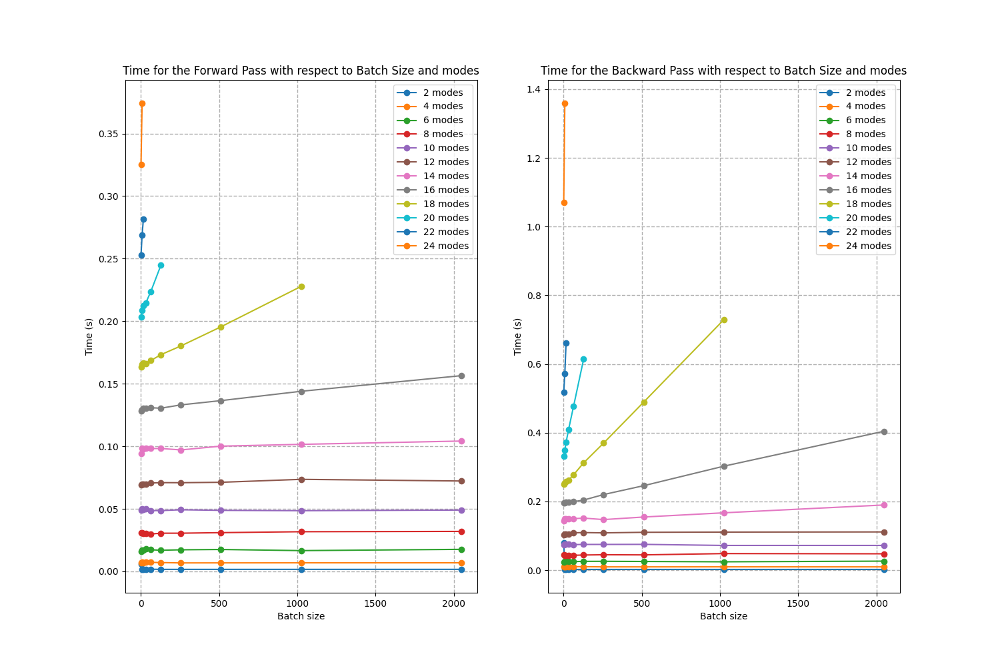

:github_url: https://github.com/merlinquantum/merlin

.. _performance:

===========
Performance
===========

MerLin is a quantum machine learning framework designed specifically for photonic quantum computing, leveraging the unique properties of single-photon quantum systems.

MerLin Quantum Layers can be executed on either CPU or GPU, like any other PyTorch module:

.. code-block:: python

   import merlin as ML # Package: merlinquantum, import: merlin
   import torch

   device = torch.device('cuda' if torch.cuda.is_available() else 'cpu')

   # Create a simple quantum layer
   quantum_layer = ML.QuantumLayer.simple(
       input_size=3,
       n_params=50,  # Number of trainable quantum parameters
       device = device
   )

Therefore, these Quantum Layers must be optimized for efficient GPU execution across varying batch sizes, mode counts, and photon numbers.

Here, we analyze the memory and computation time requirements for running a GenericInterferometer with :math:`m` modes and :math:`2m(m-1)` trainable parameters (:math:`m(m-1)` beam splitters and :math:`m(m-1)` phase shifters).
The analysis was performed on an NVIDIA H100 GPU with 80GB of VRAM. We run a simple code that you can find `here <https://github.com/merlinquantum/merlin/tree/main/tests/memory_benchmark.py>`_, in which we want to learn a target distribution by training the beam splitters and phase shifters of our interferometer.
We have used the ``pyNVML`` library for memory monitoring (`documentation <https://developer.nvidia.com/management-library-nvml>`_)

-------------------
 Memory Performance
-------------------
First, we analyze the performance needed to train an interferometer with ``m`` modes using ``m//2`` photons for ``m`` from 2 to 24 and varying the batch size from 1 to 2048.

.. image:: img/SW-BS.png
   :alt: Memory usage with respect to different batch sizes for m-mode interferometers with m/2 photons
   :width: 600px
   :align: center

Then, we analyze the performance needed to train m-mode interferometers with 1 to ``m//2`` photons for ``batch_size=1``:

.. image:: img/SW-photons.png
   :alt: Memory usage with respect to different number of photons, for different sizes of interferometers
   :width: 600px
   :align: center

**Conclusion**: we can run up to 24 modes with 12 photons with a Batch size of 16 on the H100 !

----------------
Time Performance
----------------

Here, we compare the average time required for different operations on the H100 GPU. First, we display the computation time needed for the ``QuantumLayer`` with varying numbers of photons:

.. image:: img/SW-layer-photons.png
   :alt: Compilation time for the ``QuantumLayer`` with different numbers of photons
   :width: 600px
   :align: center

Next, we compare forward and backward pass times for different numbers of photons:

.. image:: img/SW-times-photons.png
   :alt: Forward and Backward times for the ``QuantumLayer`` with different numbers of photons
   :width: 600px
   :align: center

And then, we compare forward and backward pass times for different batch sizes:

**Conclusion**: The ``QuantumLayer`` demonstrates reasonable computation times, making it suitable for integration within PyTorch-based workflows.

------------------------------
Pushing the H100 to its limits
------------------------------

We increase the number of modes from 50 to 350 and we vary the number of photons from 1 to 3 with a batch size of 1 to observe GPU performance with a high number of modes:

.. image:: img/SW-few-photons.png
   :alt: Memory usage for the m-mode interferometer with respect to the number of photons
   :width: 600px
   :align: center

**Conclusion**: We can increase the number of modes above 350 with a H100 GPU

---------------------
Now it is your turn !
---------------------

Let's push your GPU to its limits ! Follow our code here: `memory_benchmark <https://github.com/merlinquantum/merlin/tree/main/tests/memory_benchmark.py>`_
