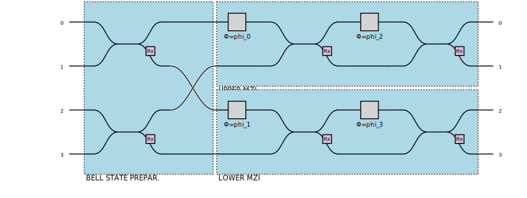
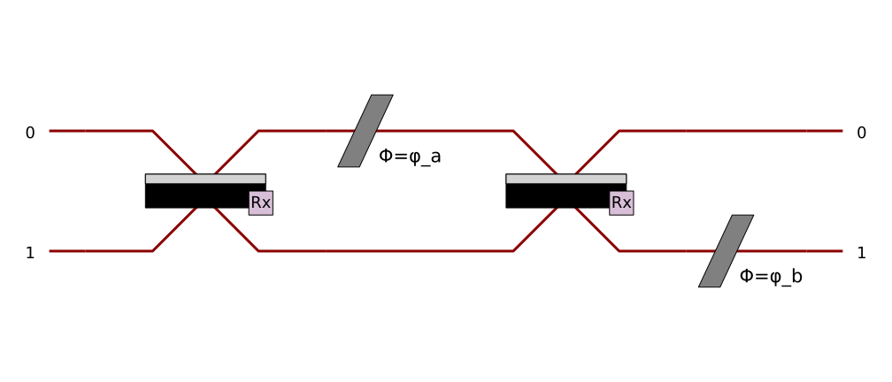
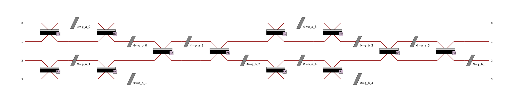
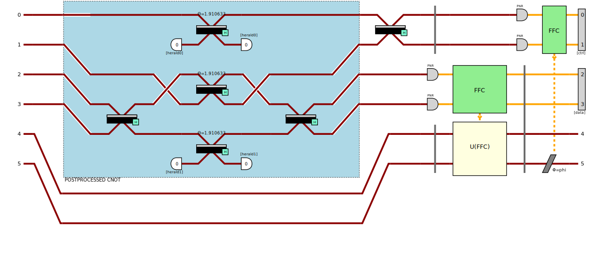

:github_url: https://github.com/merlinquantum/merlin

=====================
Quantum Architectures
=====================

Behind the scenes of any module in MerLin, there is a quantum architecture that provides the underlying computation framework.
This section provides a technical overview of the quantum architectures that power MerLin's quantum layers.
W
hile MerLin handles these complexities automatically, understanding these concepts helps you:

* Make informed architecture choices for your quantum layers
* Debug and optimize quantum model performance
* Customize advanced quantum layers when needed

*Don't worry - you won't need to implement these circuits yourself!*

For in-depth training on linear optical quantum computing, we recommend:
- the training course on `Linear Optics <https://training.quandela.com/course/d4200532-0f82-4a01-ab6e-35f202284d39>`_ on `Quandela Training Center <https://training.quandela.com/>`_
- Perceval's `Linear Optical Quantum Computing <https://perceval.quandela.net/linear_optical_quantum_computing.html>`_ documentation.

Basic Photonic Circuit
======================

A photonic circuit is the fundamental building block of quantum neural networks in MerLin.
It consists of a set of optical waveguides (modes) where photons evolve, and various optical components
(like beam splitters, phase shifters, and permutations) that manipulate the photons' paths and quantum states.

A typical photonic circuit is defined by:
- the number of modes (optical paths),
- the number and initial positions of photons,
- and the sequence of optical components applied.

For instance in the following example (from `Perceval Notebook <https://perceval.quandela.net/docs/v0.13/notebooks/Tutorial.html>`))
shows a simple photonic circuit with 4 modes. The circuit includes 6 static beam splitters, 4 [configurable](#parameters-in-photonic-circuits) phase shifters, and 1 permutation.

Each photonic circuit implements a **mathematical transformation (called a unitary transformation)** on the input quantum state.
This transformation is represented by a **unitary matrix** \( U \), which describes how quantum information changes (evolves) through the circuit.
The matrix \( U \) depends on the configuration and parameters of the optical components.

This unitary transformation is what enables quantum layers to perform non-linear operations that complement classical neural networks.

.. _parameters-in-photonic-circuits:

Parameters in Photonic Circuits
===============================

Photonic circuits in MerLin are not static. They include **configurable parameters** that play a central role in both data encoding and learning.

There are two main uses of parameters in a photonic quantum layer:

1. **Feature Encoding**:
   Classical input features (e.g., from a dataset) can be encoded into the circuit by mapping them to the values of configurable components.
   For instance, a real-valued feature \( x \) can be encoded as a phase \( \theta = f(x) \) in a phase shifter.
   This allows the quantum circuit to process classical data in a quantum-enhanced way.

2. **Trainable Parameters**:
   Other parameters in the circuit are treated as **trainable weights**, similar to those in a classical neural network.
   These parameters are optimized during training to minimize a loss function and improve model performance.

Typical configurable components include:

* **Phase shifters**, which apply a tunable phase shift to a single mode.
* **Beam splitters**, which can have tunable reflectivity or internal phase.
* **Interferometers**, where internal MZI phases are often trainable.

This dual role of parameters—**encoding** and **learning**—is what enables photonic circuits to function as powerful quantum layers in hybrid models.

Generic Interferometers
=======================

A powerful class of photonic circuits is the **generic interferometer**, typically built from a mesh of **Mach-Zehnder Interferometers (MZIs)**.
Each MZI consists of two beam splitters and a phase shifter, and can implement any 2-mode unitary transformation.

By arranging MZIs in a layered structure and tuning the internal phase shifts, a generic interferometer can implement any unitary transformation over multiple modes.
This universality makes interferometers a key component in quantum machine learning models, enabling flexible and expressive quantum layers.

The following figure illustrates a generic interferometer with 4 modes, where each MZI can be configured.

Fock States and Entanglement
============================

Photonic quantum computing uses **Fock states** to represent quantum information.
A Fock state specifies the exact number of photons in each mode, such as |1,0,2⟩ (1 photon in mode 0, none in mode 1, 2 in mode 2).

By passing Fock states through interferometers, we can generate **entangled states**, where the photon number distribution across modes becomes correlated.

Measuring the output of a photonic circuit yields a **photon number distribution** across the modes, which can be interpreted as a probability distribution over possible outcomes.

These measurement samples become the actual outputs your PyTorch model receives - just like activations from a classical layer.

Feedforward and Dynamic Circuits
================================

Advanced circuits are **feedforward architectures**, where the output of one circuit can influence the configuration of another.
This allows for **dynamic adjustment** of parameters in downstream circuits based on intermediate measurement results.

For instance, the following circuit (from this `notebook <https://perceval.quandela.net/docs/v0.13/notebooks/Quantum_teleportation_feed_forward.html>`) illustrates a feedforward architecture where photons are measured on two modes after
the first interferemoter (with blue background) and the results are used to configure the second interferometer \(U(FFC))\). A second operation of
feedforward is shown on the right side of the figure, where the results of the measurement of the two first modes are used
to reconfigure the phase shifter on the last mode.

Such architectures enable more expressive models and are particularly useful in hybrid quantum-classical workflows.

Even more complex architectures
===============================

The photonic quantum computing paradigm offers a rich toolbox of architectural possibilities. While not all features are currently implemented in every framework, understanding this landscape helps researchers envision future possibilities and guides architectural choices:

**Photon Re-injection**: After measuring certain modes, photons can be re-introduced into the circuit at different positions. This creates feedback loops that enable:
- Iterative quantum algorithms within a single layer
- Memory-like behavior in quantum circuits
- Enhanced expressivity for complex pattern recognition

**Photon Loops**: Circuits can include internal loops where photons traverse the same components multiple times with different configurations. This architecture enables:
- Quantum recurrent neural network behavior
- Temporal processing of sequential data
- Efficient parameter sharing across quantum operations

**Entangled Input States**: Rather than starting with simple Fock states, circuits can begin with pre-entangled photon configurations. This provides:
- Richer initial quantum correlations
- Access to quantum advantages from the start of computation
- Novel encoding schemes for structured data

**Hybrid Feedforward-Feedback**: Combining feedforward architecture with feedback loops creates circuits where:
- Early measurements influence both forward and backward information flow
- Quantum and classical processing steps are interleaved
- Adaptive computation paths based on intermediate results

These advanced architectures are particularly valuable for researchers exploring the frontiers of quantum machine learning, where the goal is to discover new computational paradigms that classical neural networks cannot replicate.

